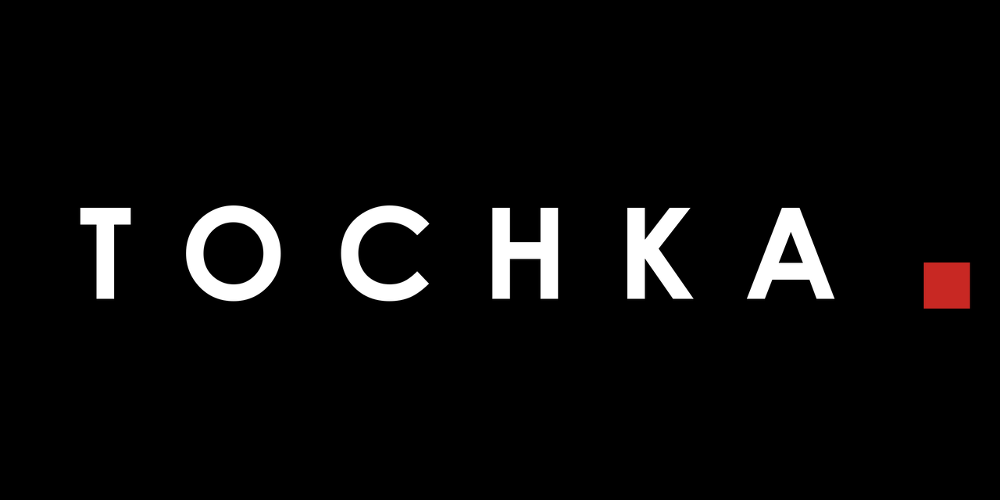

# TOCHKA

**Blender add-on: move, drag, rotate and audit object pivots — in one gesture.**

*Документация на русском: [README.ru.md](README.ru.md)*

TOCHKA is a pivot toolkit for Blender 4.2+ (tested in 5.2). It replaces the
cursor-juggling workflow of "Set Origin" with direct, visual operators and adds
a convention audit for asset pipelines.

| | |
|---|---|
|  | **Drag Pivot** — Ctrl+D, move the pivot over the surface, snap to vertices |
|  | **Align to Normal / Edge** — pivot axes follow the face under the cursor |
|  | **Rotate Pivot** — turn the pivot orientation, geometry stays put |

## Tools

### Origin to Selection
Select vertices / edges / faces (edit mode) or objects (object mode), press **D**
— the origin moves to the center of the selection. No 3D-cursor teleporting,
clean single-step undo. Works across multi-object edit: every object gets its
own origin from its local selection.

Anchors: **Median** (selection center), **Bottom** (XY median + lowest Z), **Top**.

### Drag Pivot — `Ctrl+D`
Interactively drag the pivot over the surface (raycast, works on any visible
geometry):

- **Ctrl** — snap to the nearest vertex (24 px screen radius, with a marker ring)
- **X / Y / Z** — constrain to a world axis; press again for the object's local
  axis; third press releases
- **LMB / Enter** — apply · **RMB / Esc** — cancel (nothing is touched until commit)

### Rotate Pivot — `Ctrl+Alt+D` (object mode)
Rotate the pivot *orientation* without moving geometry — for animatable parts
(wheels, doors, lids): align the local axis with the actual rotation axis and
the animator rotates with one channel.

- Move the mouse to rotate (view axis by default), **X / Y / Z** for world/local
  axis, **Ctrl** — 5° steps
- Live axis triad preview, on-screen angle readout

### Align Pivot to Normal / Edge
Hover a face: the pivot **Z** follows its normal — or switch to the edge variant
and the pivot **X** follows the longest edge of the hovered face. Targets are
sticky: moving the cursor off the mesh keeps the last valid orientation.

### Pivot Audit
Conventions drift. The audit checks pivots of selected meshes against a chosen
anchor and lists offenders as one-click select buttons:

- **Bottom Center / Bounds Center / World Origin** targets
- Suffix filter (e.g. `_geo`) and tolerance (% of object size, or meters for
  World Origin)
- **Fix All Flagged** — batch-apply the anchor; multi-user meshes are skipped

## Installation

Blender 4.2+ extension:

1. Edit → Preferences → Get Extensions → ⌄ (Install from Disk)
2. Pick `tochka_v1.0.0.zip` from the
   [latest release](https://github.com/abyrvalg379/tochka/releases/latest)

The add-on enables itself as **TOCHKA**.

## Hotkeys

| Key | Action |
|---|---|
| `D` | Origin to Selection (Median) |
| `Alt+D` | Pie menu |
| `Ctrl+D` | Drag Pivot |
| `Ctrl+Alt+D` | Rotate Pivot (object mode) |

All tools are also available from the **TOCHKA** tab in the N-panel; the audit
lives there too.

## Troubleshooting

**G/R/S (or other transform hotkeys) stopped working in the 3D viewport after
updating TOCHKA?** Version 1.0.3 wrote its hotkeys into the user keymap and
replaced the system Object Mode / Mesh keymaps. Fix without resetting all
preferences:

1. Update TOCHKA to **1.0.4 or newer**
2. Preferences → Keymap → find **Object Mode** → click **Restore**
3. Repeat for **Mesh**
4. Preferences → ☰ → Save Preferences

The issue does not exist in 1.0.4+ and was never present in 1.0.0–1.0.2.

## License

GPL-3.0 — see [LICENSE](LICENSE).
