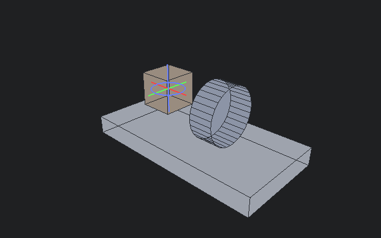

# TOCHKA

**Blender-аддон: переместить, перетащить, повернуть и проверить пивот объекта — одним жестом.**

*English documentation: [README.md](README.md)*

TOCHKA — набор инструментов для работы с пивотами в Blender 4.2+ (протестирован
в 5.2). Заменяет пляски с 3D-курсором вокруг «Set Origin» на прямые визуальные
операторы и добавляет аудит конвенций для game-ready ассетов.

| | |
|---|---|
|  | **Drag Pivot** — Ctrl+D, тащи пивот по поверхности со снапом к вершинам |
|  | **Align to Normal / Edge** — оси пивота следуют за гранью под курсором |
|  | **Rotate Pivot** — поворот ориентации пивота без движения геометрии |

## Инструменты

### Origin to Selection
Выдели вершины / рёбра / грани (режим редактирования) или объекты (объектный),
нажми **D** — пивот переедет в центр выделения. Без телепортации 3D-курсора,
честный undo одним шагом. Работает в multi-object edit: каждый объект получает
пивот по своему локальному выделению.

Якоря: **Median** (центр выделения), **Bottom** (XY-медиана + нижняя точка,
game-ready), **Top** (верхняя).

### Drag Pivot — `Ctrl+D`
Интерактивно тащи пивот по поверхности (рейкаст, работает по любой видимой
геометрии):

- **Ctrl** — снап к ближайшей вершине (радиус 24 px на экране, с маркером-кругом)
- **X / Y / Z** — ограничение мировой осью; повторное нажатие — локальная ось
  объекта; третье — снять
- **ЛКМ / Enter** — применить · **ПКМ / Esc** — отмена (до коммита ничего не меняется)

### Rotate Pivot — `Ctrl+Alt+D` (объектный режим)
Повернуть *ориентацию* пивота, не двигая геометрию — для анимируемых частей
(колёса, двери, крышки): совместить локальную ось с реальной осью вращения, и
аниматор крутит деталь одним каналом.

- Вращение движением мыши (по умолчанию вокруг оси вида), **X / Y / Z** —
  мировая/локальная ось, **Ctrl** — шаги по 5°
- Живая триада осей и вывод угла прямо во вьюпорте

### Align Pivot to Normal / to Edge
Наведи курсор на грань: ось **Z** пивота следует её нормали — или возьми вариант
с ребром: ось **X** ложится вдоль самого длинного ребра грани под курсором.
Цели «липкие»: увёл курсор с меша — последняя ориентация сохраняется.

### Pivot Audit
Конвенции плывут. Аудит проверяет пивоты выделенных мешей относительно
выбранного якоря и показывает нарушителей кнопками-селекторами:

- Якоря: **Bottom Center / Bounds Center / World Origin**
- Фильтр по суффиксу (например `_geo`) и допуск (% от размера объекта, для
  World Origin — в метрах)
- **Fix All Flagged** — пакетно поставить якорь; мульти-юзер меши пропускаются

## Установка

Эктеншн для Blender 4.2+:

1. Edit → Preferences → Get Extensions → ⌄ (Install from Disk)
2. Выбери `tochka_v1.0.0.zip` из
   [последнего релиза](https://github.com/abyrvalg379/tochka/releases/latest)

Аддон включится сам как **TOCHKA**.

## Горячие клавиши

| Клавиша | Действие |
|---|---|
| `D` | Origin to Selection (Median) |
| `Alt+D` | Pie-меню |
| `Ctrl+D` | Drag Pivot |
| `Ctrl+Alt+D` | Rotate Pivot (объектный режим) |

Все инструменты также живут во вкладке **TOCHKA** N-панели; там же — аудит.

## Лицензия

GPL-3.0 — см. [LICENSE](LICENSE).
